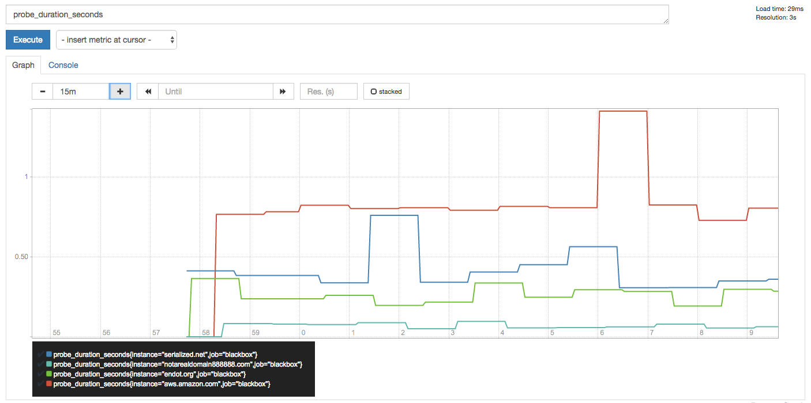

# Prometheus for Website monitoring

Simple example of using prometheus to track website uptime.

[Prometheus](https://prometheus.io) is built in a modular, "microservice" like way.

This example runs 4 small docker containers, using docker-compose to wire them together:

* The **prometheus engine** itself: Manages the state of all monitorables (in this case, the list of domains we care about monitoring)
* A process called **blackbox-exporter** which prometheus polls to actually execute the health checks
* An **Alertmanager**, which handles sending and managing state for alerts.
* A small dummy flask app (**alertlogger**) which just gets anything posted to it and logs it to a file, so we can see what would be alerted upon.

Normally Alertmanager would be publishing alerts to something like Opsgenie, Slack, etc, but for now we can just keep an eye on what they're doing by sending them to a file via the alertlogger.

To get going make sure you have [docker-compose](https://docs.docker.com/compose/) (and docker) installed and run

      # Create the data folder for storing prometheus's ephemeral information

    $ mkdir data

      # edit the blackbox_targets.yml file to configure the sites you need, some defaults (including a non-existent site) have been provided.

      # This builds the tiny python webserver container that logs alert data
    $ docker-compose build

      # start all the containers
    $ docker-compose up -d

      # keep an eye on the logs coming out over the alertmanager
    $ tail -f data/alerts.log

Then go to http://localhost:9090/alerts in your browser to see what, if any hosts are alerting.

You can also see the other metrics that are tracked. 

* Go to http://localhost:9090/graph
* Type `probe_` then another name (`probe_duration_seconds` is an interesting one to see performance over time.)

These metrics could easily be added to a Grafana dashboard, as it has excellent Prometheus support.

For production use:

* Prometheus and the blackbox exporter can be run in multiple hosts (and/or multiple data centers)
* Alert manager can be run highly availably (they communicate with each other over a mesh protocol to block duplicate alerts)
* You can run Grafana or other dashboards and see other information (like response time, etc)
* Instead of a static `config/blackbox_targets.yml`, a second container could be run to programatically fetch those lists from an external source, such as a database or external API, and update the file. (The contents are dynamically reloaded within 30 seconds as needed.)
* Other types of probes (beyond HTTP) can be configured, the blackbox_exporter is hugely versatile.

For full documentation see

* [Prometheus](https://prometheus.io/)
* [Blackbox Exporter](https://github.com/prometheus/blackbox_exporter)
